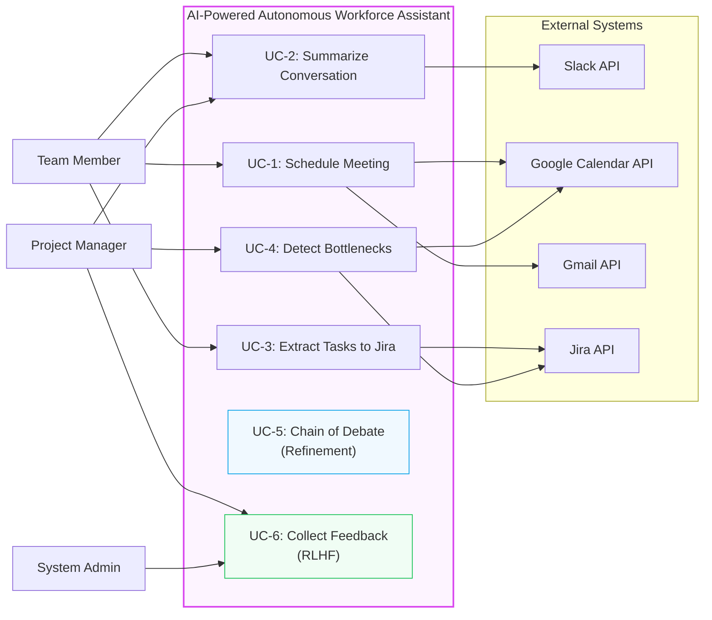
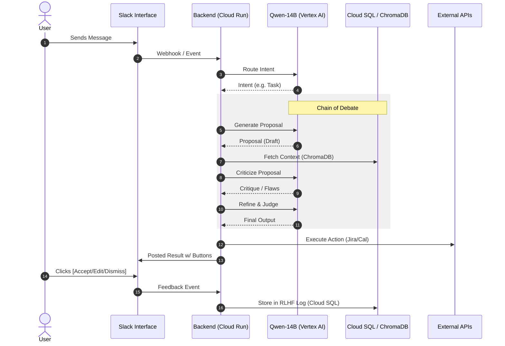
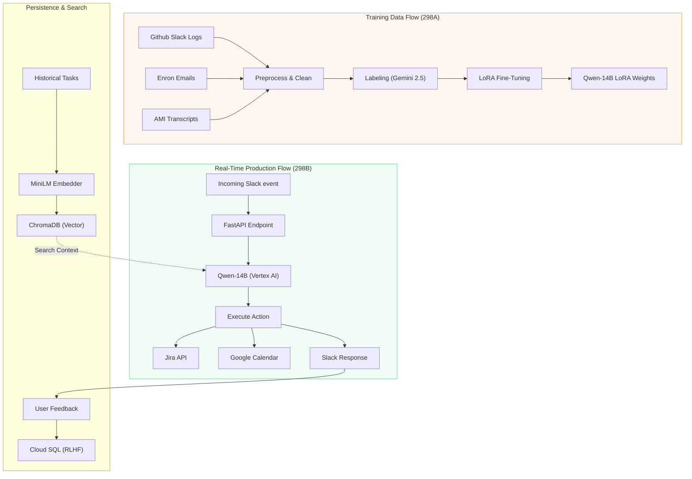
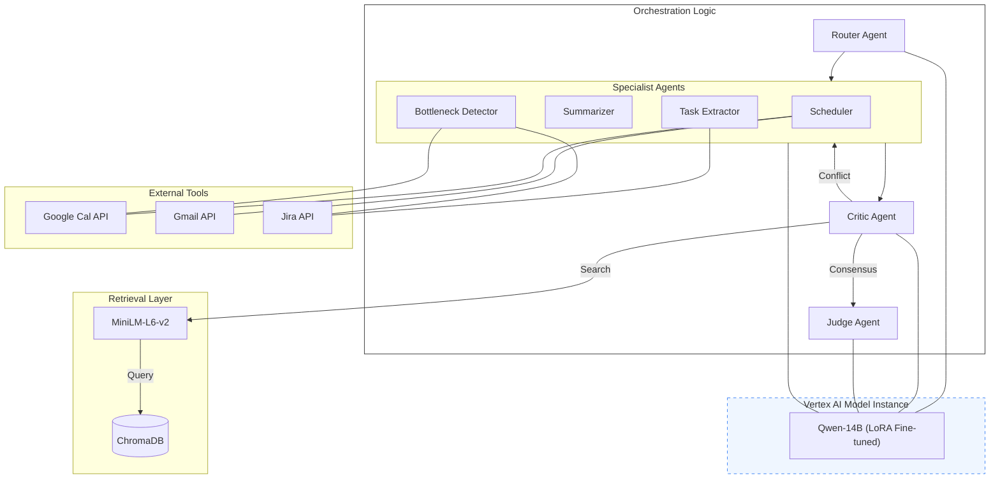
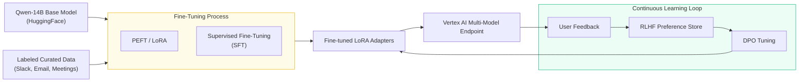
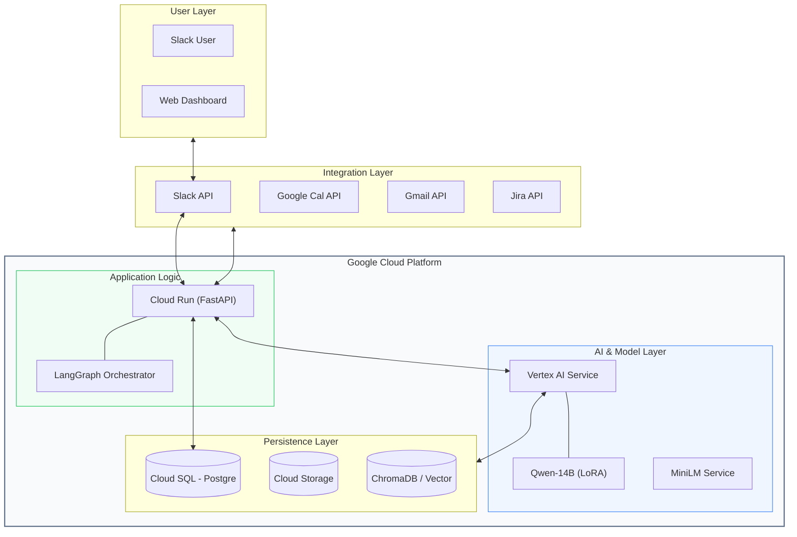

# System Architecture Diagrams (Updated)

**AI-Powered Autonomous Workforce Assistant**
DATA 298B — MSDA Project II, Team 5

---

## 1. Use Case Diagram
**Description:** Defines the system boundary, primary actors, and core functional requirements.

---

## 2. Workflow Diagram
**Description:** Step-by-step sequence from user request in Slack to final execution and feedback.

---

## 3. Data Flow Diagram
**Description:** Illustrates the movement of data during training (298A) and real-time production (298B).

---

## 4. Agents & Orchestration
**Description:** Detailed view of the multi-agent system powered by a single Qwen-14B model.

---

## 5. ML Pipeline & Fine-Tuning
**Description:** The lineage of the model from base weights to fine-tuned production state.

---

## 6. End-to-End Architecture
**Description:** Full system integration within the Google Cloud Platform ecosystem.

